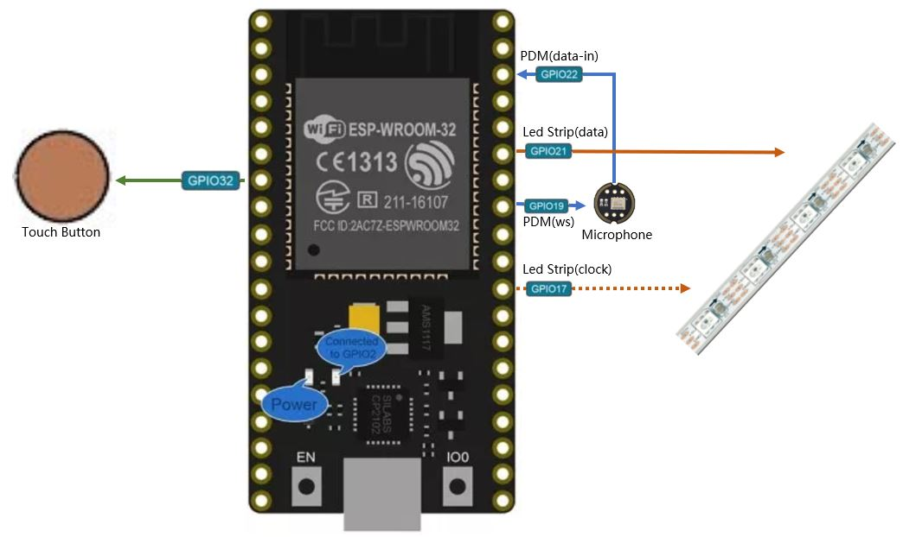

# 音乐灯带
音乐灯带实时跟随当前环境声音，在led灯带上展现不同的虚拟效果。
程序基于ESP32模块，在Arduino或者[ESPHome](https://esphome.io/)平台上运行（ESPHome平台可方便接入[HomeAssistant](https://www.home-assistant.io)）。
Real-time LED strip music visualization running on ESP32 based on Arduino or [ESPHome](https://esphome.io/) platform（ESPHome can connect to [HomeAssistant](https://www.home-assistant.io) easily）.

## 效果
to be done

## 硬件与连接

注：你可以修改其中的GPIO口，但请同时修改程序中的定义。

to be done

## ESPHome平台下的安装使用
##### 拷贝`music_leds_esphome.h`与`include`目录到ESPHome的配置目录中
`git clone https://github.com/zhujisheng/audio-reactive-led-strip`

`cp -r audio-reactive-led-strip/include/ ~/esphome-config/`

`cp audio-reactive-led-strip/music_leds_esphome.h ~/esphome-config/`

注：类似的命令，只要完成一个目录（目录中4个文件）和一个文件的拷贝就可以了。

##### ESPHome Yaml配置
【灯带的配置】
```yaml
esphome:
  name: ......
  platform: ESP32
  board: ......
  includes:
    - music_leds_esphome.h

.......

light:
  - platform: fastled_clockless
#  - platform: fastled_spi
    id: LedsStrip
    chipset: NEOPIXEL
    #chipset: APA102
    pin: GPIO21
    #data_pin: GPIO21
    #clock_pin: GPIO17
    num_leds: 60
    #rgb_order: BGR
    name: "MUSIC LEDS"
    effects:
      - addressable_rainbow:
      - addressable_lambda:
          name: Scroll with Music
          update_interval: 0s
          lambda: |-
            music_leds.ShowFrame(MODE_SCROLL, &it);
      - addressable_lambda:
          name: Energy with Music
          update_interval: 0s
          lambda: |-
            music_leds.ShowFrame(MODE_ENERGY, &it);
      - addressable_lambda:
          name: Spectrum with Music
          update_interval: 0s
          lambda: |-
            music_leds.ShowFrame(MODE_SPECTRUM, &it);
```
1. 在`esphome`域中增加包含`music_leds_esphome.h`文件
2. 按照常规[fastled](https://esphome.io/components/light/fastled.html)灯带配置（支持3线与4线的各种灯带）
3. 在正常配置基础上，增加随音乐而动的`addressable_lambda`效果

【触摸按钮的配置】
```yaml
esp32_touch:
#  setup_mode: True
binary_sensor:
  - platform: esp32_touch
    name: "Touch Pad on ESP32"
    pin: GPIO32
    threshold: 1000
    on_press:
      then:
        - light.toggle: LedsStrip
```

## Arduino平台下的安装使用
##### 在arduino中安装必要的库
to-be-done

##### 拷贝`music_leds_arduino.ino`与`include`目录
`git clone https://github.com/zhujisheng/audio-reactive-led-strip`

`cp -r audio-reactive-led-strip/include/ ~/arduino_dir/`

`cp audio-reactive-led-strip/music_leds_arduino.ino ~/arduino_dir/`

注：类似的命令，只要完成一个目录（目录中4个文件）和一个文件的拷贝就可以了。

##### 编译上传
to-be-done