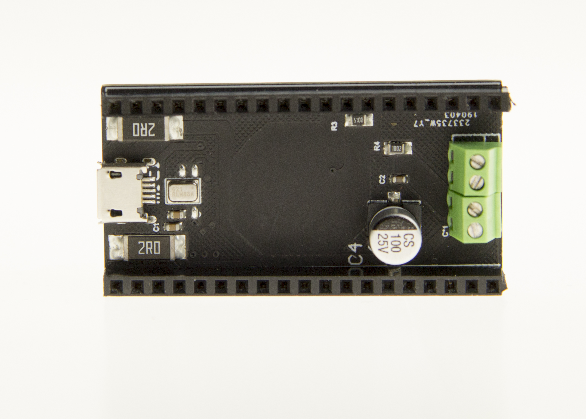
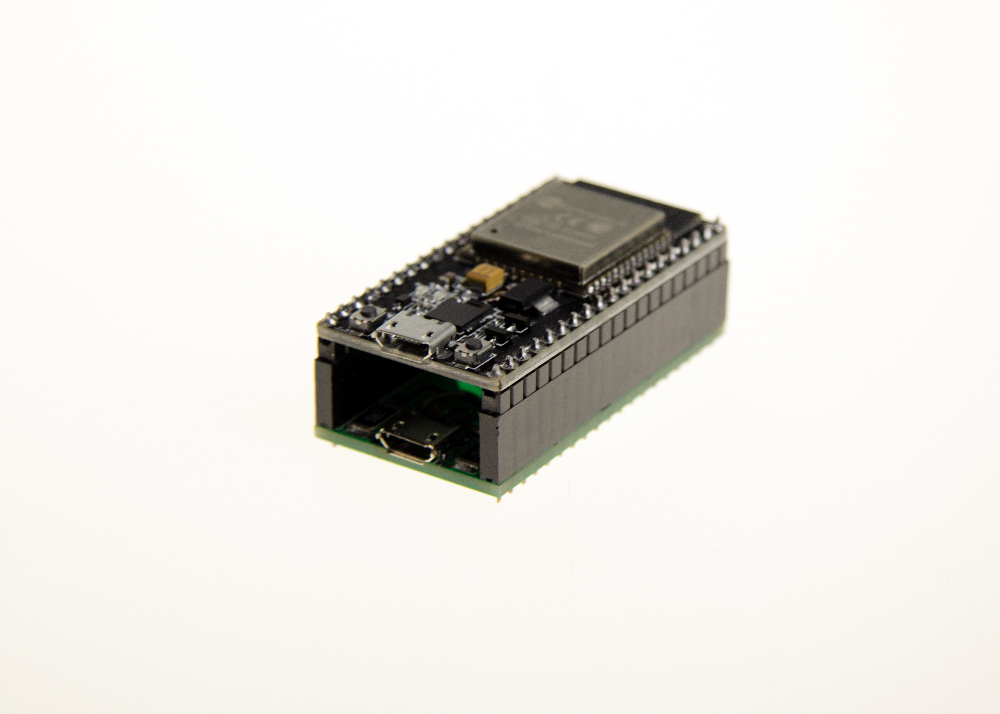
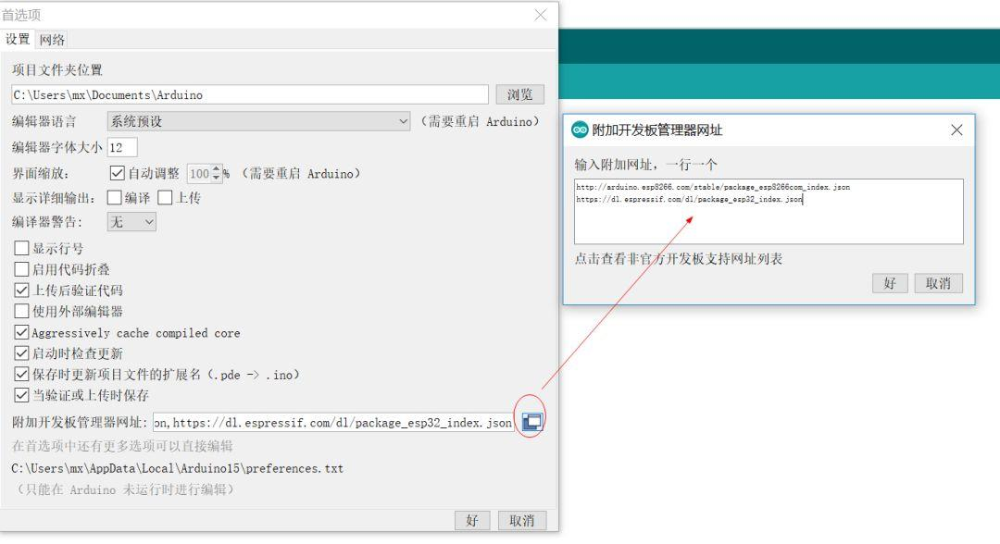
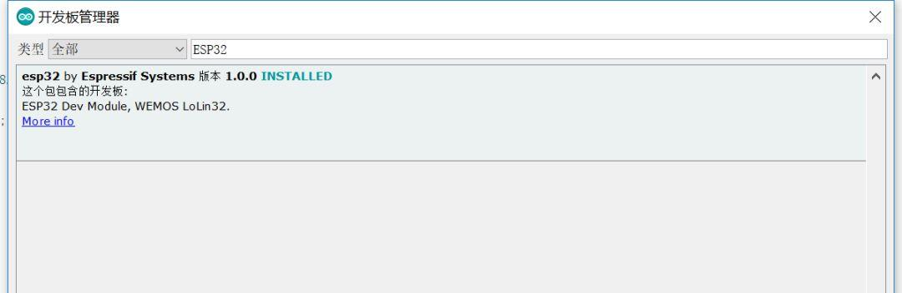
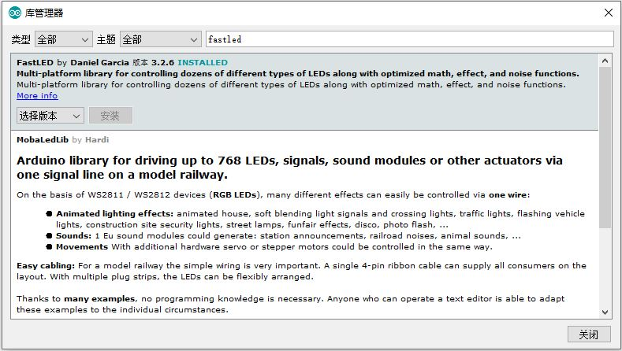
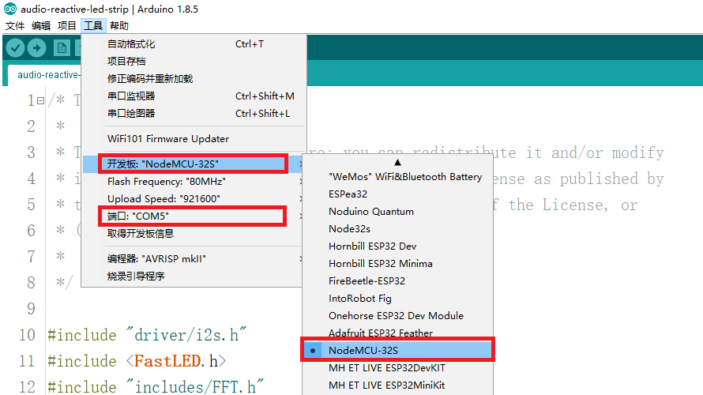

# 项目正在开发进行中，敬请期待……
# 音乐灯带
音乐灯带实时跟随当前环境声音，在led灯带上展现不同的虚拟效果。
程序基于ESP32模块，在Arduino或者[ESPHome](https://esphome.io/)平台上运行（ESPHome平台可方便接入[HomeAssistant](https://www.home-assistant.io)）。

Real-time LED strip music visualization running on ESP32 based on Arduino or [ESPHome](https://esphome.io/) platform（ESPHome can connect to [HomeAssistant](https://www.home-assistant.io) easily）.

## 效果
to be done

## 硬件与连接
#### 物理连接图

注：你可以修改其中的GPIO口，但请同时修改程序中的定义。

#### 麦克风模块板与连接
可以直接购买使用HAChina的麦克风模块板，其中包含：一个PDM数字麦克风，一个触摸按钮，方便连接灯带的接线柱。

并且能与nodemcu-32s方便对接。




## ESPHome平台下的安装使用
##### 拷贝`music_leds_esphome.h`与`include`目录到ESPHome的配置目录中
`git clone https://github.com/zhujisheng/audio-reactive-led-strip`

`cp -r audio-reactive-led-strip/include/ ~/esphome-config/`

`cp audio-reactive-led-strip/music_leds_esphome.h ~/esphome-config/`

注：类似的命令，只要完成一个目录（目录中4个文件）和一个文件的拷贝就可以了。

##### ESPHome Yaml配置
【配置灯带】

0. 在ESPHome中应用向导生成基础yaml配置文件
1. 在yaml配置文件的`esphome`域中增加包含`music_leds_esphome.h`文件（如下面样例）
2. 按照常规[fastled](https://esphome.io/components/light/fastled.html)灯带配置（支持3线与4线的各种灯带）
3. 在正常配置基础上，增加随音乐而动的`addressable_lambda`效果
4. 编译固件，上传。启动后，在HomeAssistant配置中接入。

注：
- 上传固件到ESP32开发板时，需要按住板上IO0按钮（或者boot按钮）。
- 在供电不足时，上传后ESP32无法正常工作，增加电力供应即可。
- 如果你修改配置中`num_leds`（灯带上led的数量），请同时修改`music_leds_esphome.h`文件中的`N_PIXELS`(缺省为60)

```yaml
esphome:
  name: ......
  platform: ESP32
  board: ......
  includes:
    - music_leds_esphome.h

.......

light:
  - platform: fastled_clockless
#  - platform: fastled_spi
    id: LedsStrip
    chipset: NEOPIXEL
    #chipset: APA102
    pin: GPIO21
    #data_pin: GPIO21
    #clock_pin: GPIO17
    num_leds: 60
    #rgb_order: BGR
    name: "MUSIC LEDS"
    effects:
      - addressable_rainbow:
      - addressable_lambda:
          name: Scroll with Music
          update_interval: 0s
          lambda: |-
            music_leds.ShowFrame(MODE_SCROLL, &it);
      - addressable_lambda:
          name: Energy with Music
          update_interval: 0s
          lambda: |-
            music_leds.ShowFrame(MODE_ENERGY, &it);
      - addressable_lambda:
          name: Spectrum with Music
          update_interval: 0s
          lambda: |-
            music_leds.ShowFrame(MODE_SPECTRUM, &it);
```

【配置触摸按钮】

以下配置实现Touch Pad开关灯的效果。
进一步的Touch Pad配置，参考：[https://esphome.io/components/binary_sensor/esp32_touch.html](https://esphome.io/components/binary_sensor/esp32_touch.html)

```yaml
esp32_touch:
#  setup_mode: True
binary_sensor:
  - platform: esp32_touch
    name: "Touch Pad on ESP32"
    pin: GPIO32
    threshold: 1000
    on_press:
      then:
        - light.toggle: LedsStrip
```

## Arduino平台下的安装使用
##### 在arduino IDE中安装ESP32开发库

启动arduino IDE ,在首选项中添加ESP32开发板网址：`https://dl.espressif.com/dl/package_esp32_index.json`


添加完成之后，打开开发板管理器，搜索ESP32，安装即可，由于网络原因，可能需要多安装几次才能成功。

##### 在arduino IDE中安装fastled库
在菜单`项目` `加载库` `管理库……`中查找并安装最新版本的`fastled`。


##### 克隆项目
`git clone https://github.com/zhujisheng/audio-reactive-led-strip`

##### 编译上传
1. 在Arduino中打开`audio-reactive-led-strip.ino`
2. 电脑USB口连接ESP32模块
3. 在菜单`工具`中选择正确的开发板与端口（串口）

4. 编译上传即可
5. 如果连接非三线60led的灯带，可以修改`audio-reactive-led-strip.ino`文件中的一些定义


## 致谢
本项目的实现参考项目[https://github.com/scottlawsonbc/audio-reactive-led-strip](https://github.com/scottlawsonbc/audio-reactive-led-strip)。但完全使用C++实现，运行硬件架构也更简洁（不需要带声音输入设备的PC或树莓派），并且能与HomeAssistant快速集成。

本项目中应用的PCB板的设计与生产，由[徐和平](https://github.com/Zack-Xu)同学完成。