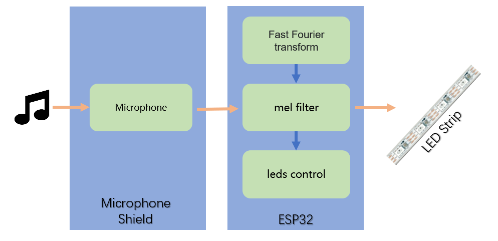

[中文](README-Chinese.md)

# Audio Reactive LED Strip


## Overview

This project realizes a realtime music visualization LED strip.

The only hardware needed is an ESP32 board, a microphone, and a controllable LED strip.



The programs running on ESP32 is compiled in [Arduino IDE](https://www.arduino.cc/en/software). Besides, [ESPHome platform](https://esphome.io/) is also supported.

## Hardware

| HARDWARE | RECOMMEND |
| -- | -- |
| an ESP32 Board | Nodemcu-32s |
| a PDM Microphone | HaChina's Microphone Shield |
| a Controllable LED Strip | APA102/WS2812/... |

*You can find all supported LED Strip in [FastLED Libary](https://github.com/FastLED/FastLED#supported-led-chipsets).*

- How do they connect together?

    

    *If you use an I2S microphone, you should modify the program(I2s is supported by ESP32-IDF)*

- What's HaChina's Microphone Shield?

    + It contains a PDM Microphone, a Touch Button, post connectors(making connection to LED strip easily).
    + It can be plugged into NodeMCU-32S directly.
    + It can also act as a remote microphone for [voice_assistant](https://github.com/zhujisheng/hassio-addons/tree/master/voice_assistant).

    

    *Touch Button is connected to GPIO32*

- Where can I buy HaChina's Microphone Shield?

    You can [buy it on taobao](https://item.taobao.com/item.htm?spm=a2oq0.12575281.0.0.72b71debDp3XOI&ft=t&id=592861974901).

    Or if you are not in mainland China, you can email your needs information to <zhujisheng@gmail.com>.

## [Arduino IDE](https://www.arduino.cc/en/software)

- Install ESP32 Board

    Add ESP32's package url in `Additional Boards Manager URLs` of the menu `Preferences`: `https://dl.espressif.com/dl/package_esp32_index.json`

    

    Open `Boards manager...` in menu `Tools`. Search `ESP32`, then install it.

    

- Install Fastled library in Arduino

    Search and install `FastLED` in menu `Sketch`/`Include Library`/`Manage Libraries...`.

    

- Clone the project

    `git clone https://github.com/zhujisheng/audio-reactive-led-strip`

- Compile&Upload

    1. Open `audio-reactive-led-strip.ino` in Arduino
    2. Connect to ESP32 by the USB
    3. Select the correct `Board` and `Port` in the menu `Tools`
    
        
    
    4. Upload
    5. Modify [`N_PIXELS`](https://github.com/zhujisheng/audio-reactive-led-strip/blob/master/audio-reactive-led-strip.ino#L56) in file`audio-reactive-led-strip.ino`, if the number of LEDs on strip is not `60`.
    6. Modify [`FastLED.addLeds<...>(...)`](https://github.com/zhujisheng/audio-reactive-led-strip/blob/master/audio-reactive-led-strip.ino#L105) in file`audio-reactive-led-strip.ino`, if LED strip has a clock pin(e.g. APA102).

## Run on ESPHome Platform

- Copy Source Code to ESPHome's Config Directory

    ```sh
    git clone https://github.com/zhujisheng/audio-reactive-led-strip
    cp -r audio-reactive-led-strip/includes/ ~/esphome_config/
    cp audio-reactive-led-strip/music_leds_esphome.h ~/esphome_config/
    ```

    *If you run on ESPHome Add-on, the ESPHome's config directory is `/config/esphome/`(`/config/` is the HomeAssistant Core's config directory.)*


- Config ESPHome Yaml

    1. Generate the basic configuration yaml in ESPHome by wizard.

    2. Add `includes` in domain `esphome`

        ```yaml
        esphome:
          name: ......
          platform: ESP32
          board: ......
          includes:
            - music_leds_esphome.h
            - includes/FFT.h
            - includes/ExpFilter.h
            - includes/VisualEffect.h
            - includes/gaussian_filter1d.h
        ......
        ```

    3. Config the [fastled light](https://esphome.io/components/light/fastled.html), and add some effects you like (as example below)

        ```yaml
        light:
          - platform: fastled_clockless
        #  - platform: fastled_spi
            id: LedsStrip
            chipset: NEOPIXEL
            #chipset: APA102
            pin: GPIO21
            #data_pin: GPIO21
            #clock_pin: GPIO17
            num_leds: 60
            #rgb_order: BGR
            name: "MUSIC LEDS"
            effects:
              - addressable_rainbow:
              - addressable_lambda:
                  name: Scroll with Music
                  update_interval: 0s
                  lambda: |-
                    music_leds.ShowFrame(MODE_SCROLL, &it);
              - addressable_lambda:
                  name: Energy with Music
                  update_interval: 0s
                  lambda: |-
                    music_leds.ShowFrame(MODE_ENERGY, &it);
              - addressable_lambda:
                  name: Spectrum with Music
                  update_interval: 0s
                  lambda: |-
                    music_leds.ShowFrame(MODE_SPECTRUM, &it);
        ```
    4. Compile and upload the firmware.
    5. Config the esphome in HomeAssistant

    *Modify `num_leds` in configuration YAML, and `N_PIXELS` in `music_leds_esphome.h` both, if the number of LEDS is not `60`.*


- Config TouchPad

    If a [TouchPad](https://esphome.io/components/binary_sensor/esp32_touch.html) is connected to ESP32( which is already included in the HaChina's Microphone Shield ), you can config it to control the LED Strip.

    ```yaml
    esp32_touch:
    #  setup_mode: True
    binary_sensor:
      - platform: esp32_touch
        name: "Touch Pad on ESP32"
        pin: GPIO32
        threshold: 1000
        on_press:
          then:
            - light.toggle: LedsStrip
    ```

## Thanks

[https://github.com/scottlawsonbc/audio-reactive-led-strip](https://github.com/scottlawsonbc/audio-reactive-led-strip)

[Zack-Xu](https://github.com/Zack-Xu), designer of the microphone shield PCB.